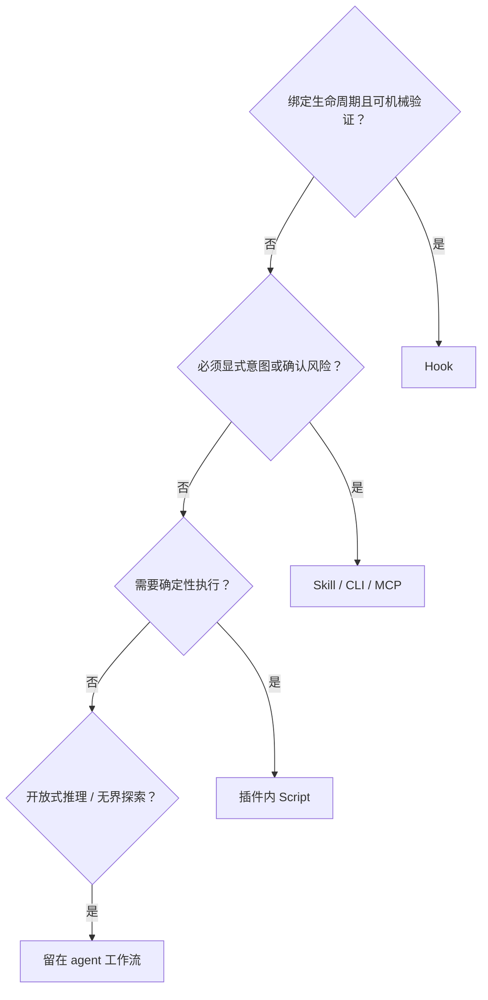
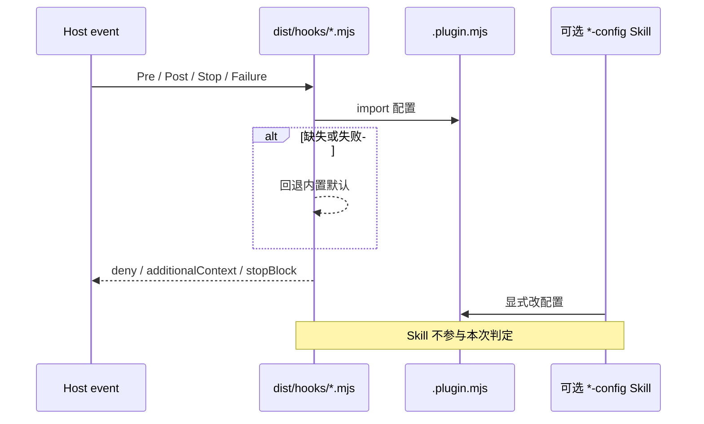
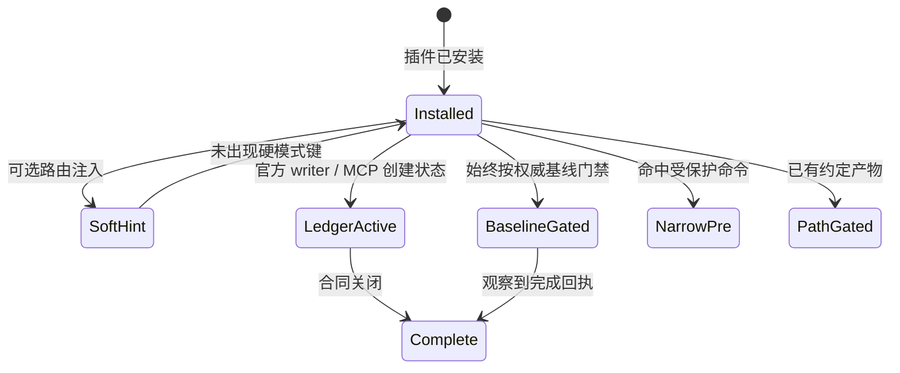
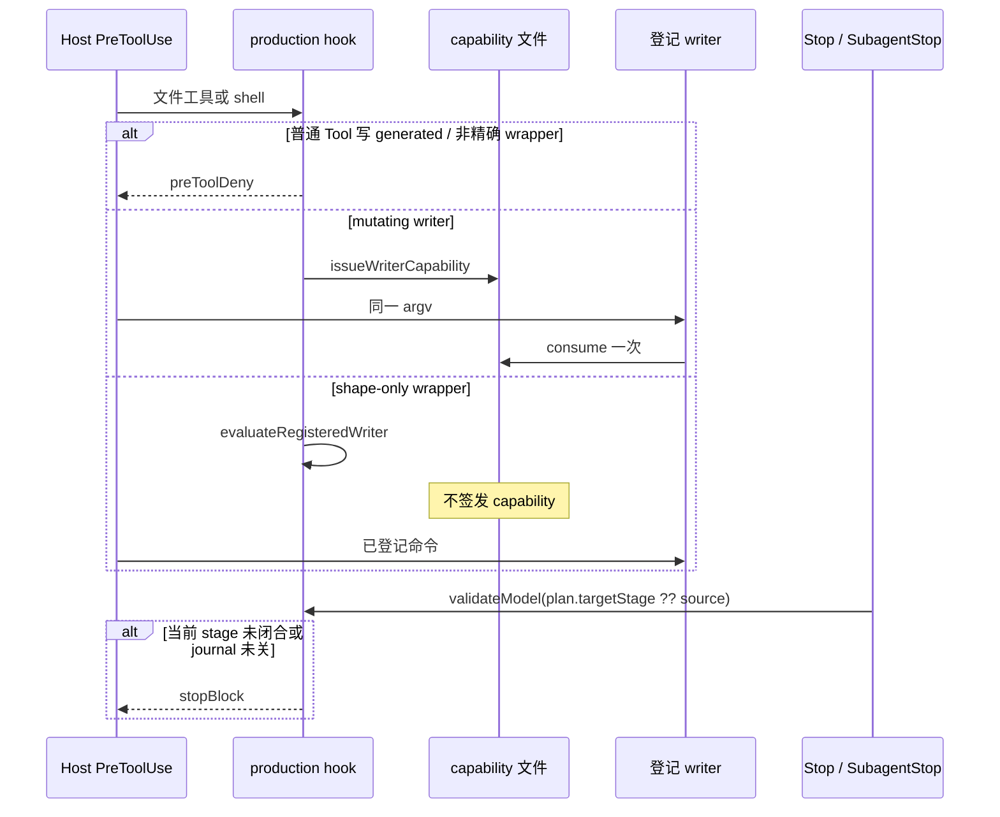

# Skill 与 Hook 协作准则

| 字段 | 值 |
| --- | --- |
| 文档标题 | Skill 与 Hook 协作准则 |
| 作者 | Harness Start / plugins maintainers |
| 日期 | 2026-08-17 |
| 状态 | Working |
| 性质 | 规范性设计准则。约束新插件与既有插件的协作方式，不是库存盘点。 |
| 原则层 | `docs/architecture.md`。本文展开 Skill / Hook / Script / CLI / MCP 的协作合同，不重写原则层。 |

本文中的 **必须**、**应当**、**禁止** 对插件作者和维护者有约束力。示例插件名只用来说明规则，不构成必须覆盖的清单。

## 1. 目的

把宿主生命周期里的机械约束和工作方法拆开：

- Hook 绑定生命周期事件，只做可机械验证的拒绝、报告、短注入和状态推进。
- Skill 提供配置、诊断、领域方法与显式工作流入口。
- Script 是 Hook 或显式入口调用的确定性执行单元。
- CLI / MCP 是必须由用户或 agent 明确发起的状态创建与逃生面。

目标不是另做一套编排系统，而是固定一条可复查的协作合同：同一套 Hook I/O、同一套完成条件、Skill **不是** Hook 生效前提。

## 2. 适用范围

本准则适用于本仓库发布的每一个插件，以及之后新增的插件。产品分类（工程执行、领域工程、方法编排、证据审计、领域生产、交付治理、输出治理）用于安装与选型；协作模式（第 6 节）用于设计与评审。两种分类正交。

本准则不替代各插件 README、合同测试或验收材料。插件特有的路径、stage 集和校验器写在该插件自己的合同里。

## 3. 职责划分

对齐 `docs/architecture.md` §4 与 `GUIDE.md` 3.1。

| 组件 | 必须负责 | 禁止负责 |
| --- | --- | --- |
| Hook 配置 | 事件、matcher、超时、平台根变量、入口命令 | 业务规则、跨平台兼容分支、隐式安装 |
| Hook 入口 Script | 读 stdin、规范化、调度检查、适配输出 | 长时间推理、交互式流程、无界网络 |
| `checks/` / `lib/` / `policy.ts` | 纯判定、格式化、受控状态 | 仓库级共享运行时、未使用的通用抽象 |
| Skill | 领域方法、配置、诊断、恢复；自然语言委派普通子 agent | 复制 Hook 判定；成为 Hook 生效前提 |
| CLI | 显式创建、查询、writer、校验 | 根据模糊 prompt 偷偷启动工作流 |
| MCP | 显式 capture / anchor / seal 等已登记工具 | 用发现结果冒充证据；用 Skill 名触发 MCP |

Skill **不是**每个插件的必需文件。只有 Hook 无法安全推断意图，且操作说明能显著降低错误配置或恢复成本时，才增加 Skill（`GUIDE.md` 3.1、`docs/architecture.md` §6）。

## 4. 选择顺序

设计或评审一项能力时，按下列顺序判断。不得跳过前一步去堆 Skill 或中央编排器。

1. 能力是否绑定宿主生命周期，并且输入、判定和输出可以机械验证？若是，使用 Hook。
2. 能力是否必须由用户或 agent 明确表达意图、选择策略或确认风险？若是，提供 Skill、CLI 或 MCP。
3. 能力是否需要可复用的确定性执行逻辑？若是，放入插件内 Script，由 Hook 或显式入口调用。
4. 能力是否需要长时间开放式推理、外部协调或无界探索？若是，它不得成为自动 Hook；留在 agent 工作流中。

开放式推理不得塞进每次工具事件。Hook 不得替用户或模型推断开放式意图。

## 5. 不可违反的协作不变量

下列条目对所有协作模式成立。

### 5.1 Skill 不是 Hook 生效前提

- 宿主在插件安装且（Codex）Hook 被信任后就必须调度 Hook。
- **禁止**根据 Skill 是否被加载、对话是否提到 Skill 名，决定是否注册或执行门禁。
- 硬模式只允许由可观察状态打开：磁盘账本、git HEAD、已声明产物路径、已发现 artifact、或已观察到的受保护命令。
- 加载 Skill、编辑方法正文、提到 Skill 名，都不得单独打开硬门禁。

### 5.2 一个不变量一个拥有者

同一条规则不得由多个插件重复阻断或重复注入。边界按用户能解释的责任划分，不按源文件、Skill 名称或语言包结构机械复制。

领域重叠时，必须用 `active()` 或等价条件错开，而不是让两个插件同时对同一生成路径 fail-closed。例如：声明了 `react-native` 的包把 JS lock 交给 React Native 插件；Android / JVM 用 Manifest 存在性错开 Gradle 保护。

### 5.3 同一事件少量入口

同一插件、同一生命周期事件必须优先使用一个 dispatcher，在进程内按明确顺序执行检查。禁止为每条细规则注册一个 command Hook。默认全开时宿主仍会启动这些入口；入口解析事件后必须尽快判断本插件是否相关，没有可适用目标时立即退出，不得先做 git、制品扫描或校验器。

### 5.4 平台绑定分开，业务语义共享

Claude Code 与 Codex 分别维护 manifest、Hook JSON、根目录变量和输出适配。检查函数和状态语义必须在插件内部共享。平台差异必须停在 Hook 配置或输出适配，不得渗入每条业务规则。

### 5.5 完成条件必须可机械复核

Hook 被调用、stdout JSON 格式正确、Skill 已加载、或多走几轮模型，**都不等于完成**。

完成条件必须能离线重算，例如：项目命令回执、相对 HEAD 的 git 状态、seal digest、receipt 绑定的源与输出字节、官方 writer journal 已关闭。审美、商标可注册性、印厂签字、CI「看起来绿了」或「听起来不错」不得写成 Hook 可证明的完成条件。制品交付的 Stop 只拦 cwd 在项目内、writer journal 未关闭，或本宿主会话已经观察到对应制品操作的会话；最后一种参与状态必须按 workspace、carrier 与 session 做摘要键隔离并持久化到平台插件数据目录，不得写入项目树。独立 review 的 SubagentStop 不得 fail-closed。宿主带 `stop_hook_active` 的重试必须放行。

### 5.6 自动路径与显式路径共享同一规则

自动 Hook 与 Skill / CLI / MCP 可以共享同一套配置、纯函数或状态模型，**禁止**各自实现一份会漂移的判定。

### 5.7 插件是部署与回滚边界

插件运行时禁止引用另一个插件或仓库外的共享包。通用 Hook I/O、写目标抽取、shell 分词、交付路径识别、JSONL 锁和可执行配置加载属于 `core/src`，由 esbuild 打进该插件 `dist/`。领域判定必须留在插件内。禁止新增 `skill-deps.json` 或 `vendor-skills/`。

### 5.8 Hook 不是操作系统沙箱

强度声明为 `snapshot`：只能约束宿主可观察的工具调用。宿主外进程、被替换的系统工具、直接磁盘写不在证明范围。不得把 Hook 写成封闭沙箱。

## 6. 允许的协作模式

新插件必须落入下列模式之一，或先修订本文再引入新模式。模式描述的是职责与激活方式，不是库存计数。



### 模式总表

| 模式 | 何时选用 | Hook 必须做 | Skill 允许做 |
| --- | --- | --- | --- |
| A 守卫 + 配置 | 规则可机械验证，只需可选配置 | deny / report / 记录 | 只指导改项目配置，不复制判定 |
| B 领域工程 | 语言或生态有 lock/vendor 与有界校验 | Pre 护生成依赖；Post 有界校验 | 编排开放式领域工作；Hook 通过 ≠ 完成 |
| C 会话软路由 | 只需提示加载方法，无意硬门禁 | 短 `additionalContext` | 方法正文；无账本 |
| D 首轮协议 | 每会话至多注入一次发现协议 | 一次 claim，之后静默 | 事实 / 解释 / 反例方法 |
| E 显式工作流 | 硬模式依赖账本、git、产物路径或窄命令 | 只维护已存在状态或始终在场的窄门禁 | 方法入口；提到名字不开硬模式 |
| F 产物交付 | 生成物必须走登记 writer 与合同闭包 | 形状门禁；需要时签发 capability；Stop 重验 | 编排 / 顾问 / 独立审查；Skill 可选 |
| G 界面工艺 | 机械检测 UI 反模式，不替代领域语法门禁 | 路由 + Post 扫描；Stop 不得冒充已回滚 | floor / critique / 显式项目设计记忆方法 |
| H 文稿机械审阅 | 写后可确定性定位文本信号，但最终取舍依赖语境 | Post 有界扫描并报告精确位置；不得自动改写或默认阻断 | 语义判断、保护内容、语气与显式改写流程 |

---

### A. 守卫 + 配置

**必须**

- Hook 是主路径。判定实现只存在于 Hook / `checks` / `lib`。
- 项目配置使用 Git 根下 `.<plugin>.mjs`（或插件文档列出的等价文件名），经 `import()` 加载。
- 配置缺失或加载失败时回退内置默认，不得取消默认保护。
- 若提供 Skill，它只能指导创建或修改该配置文件，不得实现第二条判定，也不得被 Hook 读取 Skill 正文。

**禁止**

- 用 Skill 覆盖 Hook 里的不可绕过规则（例如危险删除、拒绝升级窗口）。
- 在配置里加入任意命令、回调或 Hook 无法验证的替换逻辑。



示例：`command-safety` 的 `dangerousRm` 不得被用户 `mode: "allow"` 绕过；`source-integrity` 的编码检查属于 Hook，不属于 Config Skill。

---

### B. 领域工程

**必须**

- 使用 `core/src/domain-engineering-hook.ts` 的 `runDomainEngineeringHook(policy, phase)`，插件只提供 `src/policy.ts` 与入口。
- Pre：对命中的生成依赖路径 `preToolDeny`（lockfile、vendor、工具缓存、Codegen 输出等）。
- Post：对已存在、体积有界、非 cache/vendor 的目标跑 validators；缺工具时有界报告，不得假装检查已通过。
- Skill（若有）必须写明：开放式领域工作归 Skill；Hook 只管 lock / vendor 与轻量校验；**Hook 通过不等于任务完成**。
- 包管理器命令在未显式指向受保护路径时应当允许。

**应当**

- 用 `active()` 避免与相邻领域重复阻断同一生成路径。
- Post 默认超时与 `maxFiles` 保持有界；项目配置只能在文档范围内收紧或放宽。

**禁止**

- 把构建、测试、签名、真机或集群结果写成 Hook 已证明。
- 直接编辑受保护 lockfile / 依赖目录，或把 Hook 放行当成验证完成。

```ts
// core/src/domain-engineering-hook.ts
export type DomainEngineeringPolicy = {
  plugin: string;
  displayName: string;
  protections: readonly DomainProtectionRule[];
  validators: readonly DomainValidator[];
  active?: (context: DomainActivationContext) => boolean;
};
```

---

### C. 会话软路由

**必须**

- 只在 `SessionStart`（或文档写明的等价注入点）写入短 `additionalContext`。
- 当提示正文是选择窄提示所必需的输入时，允许把 `UserPromptSubmit` 作为等价注入点；该 Hook 必须无状态、不得保存提示正文、只对明确匹配的任务注入短上下文，并在解析失败时 fail-open。
- 解析失败 fail-open：跳过注入，不得锁死会话。
- 不创建业务账本，不 `stopBlock`，不因未加载 Skill 而拒绝写入。

**应当**

- 注入文本按宿主区分加载方式：Codex 读 `skills/<name>/SKILL.md`；Claude 走原生 Skill 工具。
- 只要求加载与当前任务匹配的 Skill，不得把全部方法 Skill 一次性灌进上下文。

示例：`engineering-practice` 的短方法注入、`professional-writing`、`reasoning-methods`。

---

### D. 首轮协议注入

**必须**

- 每会话最多成功 claim 一次；后续同一会话的 prompt 必须静默。
- 状态文件不得保存用户 prompt 正文。
- 缺少 session id 或平台数据目录时 fail-open：本轮仍可注入，但不得留下会误阻断后续工作的半份状态。
- 不得把发现协议做成访谈门禁或业务写屏障。

Skill 提供发现方法；Hook 只保证「至多一次」。示例：`intent-discovery`。

---

### E. 显式工作流

这一组共享的是「提到 Skill 名不会打开硬模式」，不是「一律由 CLI 创建状态」。必须先声明硬模式键，再写 Hook。

| 子类 | 硬模式何时打开 | Hook 必须 | 禁止 |
| --- | --- | --- | --- |
| 账本 / 官方 writer | CLI 或 MCP 创建并绑定状态之后 | 只维护已存在状态；拒绝直接改 ledger | 模糊 prompt 偷偷 `init` |
| 始终在场的顺序门禁 | 工作区相对权威基线（如 git HEAD）满足条件 | 按基线判定；状态只保存观察回执 | 把「本会话是否写过文件」当成权威 |
| 窄命令保护 | 观察到受保护命令 | 只拦该命令形状 | 假装已证明远端 CI / 审查通过 |
| 产物路径门禁 | 工作区已出现约定产物 | 验 sibling / digest；不 init | 同一 tool call 同时改上下游并跳过重验 |
| 收件箱提案 | 有人写出 pending 提案 | 只校验路径与 schema | 阻断无关的普通工作 |



示例：`software-debugging` 在 writer 绑定前保持惰性；`evidence-based-research` 只有 `workflow.json` 处于 open 后才开硬行为；`test-driven-development` 以 git HEAD 为基线，只在 PreToolUse 检查对应测试是否先进入当前变更，不解析测试命令或提供完成回执。

---

### F. 产物交付

共同工程边界见 `docs/artifact-delivery-guards.md`。该文若把 capability 或「只闭到 source|release」写成普遍句，以本节为准。

**所有产物插件必须**

- 工程根为 `artifacts/<carrier>/<kebab-case-id>/`。
- Stop / Post 按 `plan.targetStage`（缺省 `source`）重跑该插件自己的 `validate*Model`。
- stage 集由该插件合同声明，不得假定全球只有 `source|release`。两极 stage、中间累计 stage（`stageAtLeast`）都合法。
- 顾问 Skill（若有）不得写 generated 路径、不得签审查、不得执行 release。
- Stop 不得启动 Office、浏览器、编码器或印前工具。
- 发现已有 `plan.contract.json` 即对应该工程生效；没有产物的普通会话不得被该插件的 shell allowlist 误伤。

**mutating writer 路径必须**

- Pre 只对精确 `node <plugin>/dist/cli/<writer>.mjs <projectRoot> …` 签发一次性、短时、绑定 argv / session / subject digest 的 capability。
- writer 必须 `consumeWriterCapability` 一次，并用独占 journal + 临时文件 rename。
- 普通文件工具或非精确 wrapper 写 generated 路径必须 `preToolDeny`。

**shape-only 路径允许**

- 插件可以不提供 Skill，也可以不提供 `capability.ts`。
- Pre 只用 `evaluateRegisteredWriter` 放行已登记 wrapper（例如仅 lint / release）。
- 渲染、探测、印前若由项目外流水线生成，Hook 只核形状、magic 和 receipt，不得假装自己跑过渲染器。



---

### G. 界面工艺

**必须**

- 机械检测只针对声明的 UI 路径；不得替代领域插件的语法、lockfile 或依赖目录门禁。
- 不得把海报、幻灯片、视频、logo 等产物工程收进本模式。
- Stop 若只复扫并注入上下文，文案必须写明不是 `stopBlock`，也不是已经回滚。
- Skill 可以在新界面或实质性改版中显式维护项目拥有的 `DESIGN.md` 托管块，但必须保留块外内容；局部修复和只读审查不得创建该资产。
- 项目设计记忆只记录证据、方向、token、组件/状态合同和验证状态；不得成为 Hook 生效前提、审查印章或完成回执。

Skill 提供工艺底线、审查与设计记忆方法。检测本身不得依赖 Skill 是否加载。

---

### H. 文稿机械审阅

**必须**

- `PostToolUse` 只扫描本次工具事件可观察到的、已存在且大小有界的人类可读文稿目标。
- 确定性规则必须由插件内纯函数单独拥有；Hook 与显式 CLI 复用同一实现。
- 报告必须包含规则 id、严重级别和精确 `file:line`，并说明命中只是待语义复核的信号。
- Claude 返回非阻断 `additionalContext`；Codex 用 `continue:false` + `reason` 把诊断作为非阻断 tool feedback 交给下一轮模型，避免破坏 tool-call/output 配对。live acceptance 必须证明宿主实际接收该反馈。
- Skill 保留全文阅读、误报分类、保护区域、作者语气和改写方法；Skill 是否加载不得影响扫描是否执行。

**禁止**

- 因词法或结构信号自动改写正文，或默认阻断一次普通文稿写入。
- 把命中数量下降当成文稿质量、事实正确性或发布完成的证明。
- 扫描未观察到的全仓文件、无界大文件、生成目录、依赖目录或缓存目录。
- 复制一份仅供 Hook 使用、会与 CLI 漂移的检测规则。

## 7. 共享运行时合同

### 7.1 Hook I/O

事件 JSON 从 stdin 读入；stdout 输出放行 / 阻断决策；stderr 输出给人读的消息。

```ts
// core/src/hook-output.ts
preToolDeny(reason)           // permissionDecision: "deny"
additionalContext(event, text)
stopBlock(reason)             // { decision: "block", reason }
```

`readStdinJson()` 在空输入时得到 `{}`；非对象或 JSON 失败返回 `{ __parseError: true }`。目标抽取必须覆盖文件工具、patch 头和常见 shell 写形状（重定向、`tee`、`touch`、`sed -i` 等）。

### 7.2 fail-open 与 fail-closed

仓库 **禁止** 写「解析失败一律 fail-open」或「解析失败一律 fail-closed」。必须按该事件的误阻 / 漏阻成本选择，并由入口测试锁定。

| 默认 | 适用 |
| --- | --- |
| 解析失败 fail-open（return / exit 0） | 软路由、多数守卫、惰性工作流、shape-only 产物检查 |
| 解析失败 fail-closed | 漏阻代价是未授权实现写入或伪造交付闭包（例如顺序门禁的 Pre，或 mutating writer 的无效 JSON） |

配置加载失败必须回退内置保护，不得执行半份坏配置。若某插件选择「未知字段使整份配置回退」，必须在该插件文档写明。

### 7.3 配置

项目级 `.<plugin>.mjs` 是项目拥有、经 `import()` 加载的可信可执行配置。Config Skill 只指导改这些文件。

非法字段应当逐项回退或整份回退，不得静默改写规则语义。提交边界一类的权威文件若存在但无效，相关操作必须 fail-closed。

### 7.4 产物能力与回执

| 能力 | 模块 / 位置 | 要求 |
| --- | --- | --- |
| 发现工程根 | `artifact-paths.ts` / `artifact-scan.ts` | 只认约定 carrier 目录 |
| writer 形状 | `artifact-shell.ts` `evaluateRegisteredWriter` | 只接受精确 `node …/dist/cli/<writer>.mjs <root> …` |
| 新鲜度 | `artifact-receipt.ts` | SHA-256 绑定非生成输入与最终输出字节 |
| 原子写出 | `release-journal.ts` | 独占 journal + rename；未关 journal 阻断 Stop |
| mutating capability | 插件内 `capability.ts` | 短时、一次性、绑定 argv / session / subject |

### 7.5 状态与日志

- 插件工作目录默认被各自 `.gitignore` 忽略 `*`，禁止改项目根 `.gitignore` 来隐藏账本。
- 会话状态目录 0700、文件 0600，写入必须原子。
- Hook **禁止** 把凭据、完整 prompt 或完整事件写入日志。
- 需要审计时使用 JSONL trail；需要阻断说明时使用 `blockingContract`（observedFacts / harm / unblockWhen / recovery）。

## 8. 证据与完成条件

按工作类型选择完成条件，不得混用。

| 工作类型 | 完成必须看 | 不得当成完成 |
| --- | --- | --- |
| 领域工程 | 项目自己的测试 / 构建 / 静态分析 | Hook 未报错 |
| 顺序门禁 | 权威基线（如 git HEAD）上的上下游共同变更 | 「本会话写过文件」或 Hook 放行 |
| 调试账本 | writer 绑定后的会话回执 + 关闭扫描 | 加载了 debug Skill |
| 研究 | phase、可解析 anchor、seal digest、Stop 重验 | 提到研究 Skill 或跑过发现 |
| 产物交付 | 当前 `targetStage` 下的合同与 receipt；无 open journal | 顾问建议、预览「看起来对」 |
| 封印文稿 | 封印哈希链 + 官方 writer / ack | 直接 Edit 封印正文 |
| 远端交付 | provider 输出绑定 head SHA | 本地测试代替远端 CI |

Skill 是知识层，不是效果证据。

## 9. 平台绑定

| 维度 | 要求 |
| --- | --- |
| 插件根 | Claude 用 `CLAUDE_PLUGIN_ROOT`；Codex 用 `PLUGIN_ROOT` |
| 数据目录 | Claude 用 `CLAUDE_PLUGIN_DATA`；Codex 用 `PLUGIN_DATA` |
| 信任 | Codex 必须经 `/hooks` 审查并信任；安装成功不得写成 Hook 已在跑 |
| 事件差 | `PostToolUseFailure` 不是双平台必选项；缺失时必须用 Post 或其它已注册事件收口，并在该插件文档写明 |
| 工具报告 | 默认情况下，Codex 的工具生命周期非阻断报告只写 stderr；允许模式 H 使用 `continue:false` + `reason` 替代普通工具回执，把写后诊断交给模型且保持 tool-call/output 配对，并须由当前 Codex live acceptance 证明。deny / block 与会话级注入保持结构化输出 |
| MCP | 仅在确有已登记工具时提供；声明方式按宿主，不得假设未声明的 MCP 一定可见 |
| Provenance | Codex hook 应当设置 `AI_EXPERTS_SESSION_ID` / `AI_EXPERTS_TRIGGER_FROM` |

特定 provider 的输出适配（例如先存回执再非零 stderr）必须文档化，且不得分裂成第二条业务规则。

## 10. Subagent

- **禁止** 提供中央 subagent 编排插件，或用插件级 `plugins/<name>/agents/*.md` 做跨平台编排。Codex 插件契约没有该组件，见 `docs/custom-agents-in-claude-code-and-codex.md`。
- Skill 目录里的 `agents/openai.yaml` 只是宿主 Skill 元数据，不是编排组件。
- 领域 Skill 可以用自然语言请求宿主创建**普通**子 agent。子输出只是建议；父 agent 必须核对证据并交付。
- Hook **禁止** 建立 reservation、nonce、mailbox 或跨平台审批协议。不要用 `SubagentStart` 做身份协议。
- `SubagentStop` 可以复用主会话的同一领域检查。这只表示「同一规则覆盖子会话」，不表示仓库接管子 agent 生命周期。

## 11. 安全与隐私

| 主题 | 要求 |
| --- | --- |
| 解析与配置 | 见 §7.2、§7.3 |
| 写入 | 普通 Tool 不得写 generated 路径；mutating writer 必须消耗有效 capability |
| 日志 | 不得记录凭据、完整 prompt、完整事件 |
| 可执行配置 | 项目拥有；失败回退默认 |
| 研究捕获 | 私有权限；出站 HTTP 必须做公开地址检查；seal 不是抗同用户恶意进程的签名 |
| 源仓迁移 | 破坏性过滤只允许在目标侧临时 clone，源仓保持只读 |

威胁模型：攻击者是已获得宿主工具面的 agent，不是任意 OS 进程。

## 12. 延迟与可观测

- 同事件合并 dispatcher；matcher 和超时留在平台 Hook JSON。
- 注入必须短小，且限于本插件责任。
- 常见超时应当有界（守卫约 10s；有界校验可更长；产物探测类事件可再放宽，但必须写在该插件 Hook JSON）。
- 没有中央 metrics。误阻靠 stderr 文案与 acceptance 发现。
- Codex 未信任 Hook 时，文档与验收必须按「未执行」处理，不得按「已守卫」处理。

## 13. 禁止的替代方案

| 方案 | 禁止原因 |
| --- | --- |
| 仅 Skill 软约束 | 拦不住 lockfile 直改、危险删除、未观察回执就改实现、伪造 writer |
| 中央超级 Hook / 编排器 | 破坏独立安装与「一个不变量一个拥有者」；单点失败影响全部 |
| 跨插件运行时依赖 | Claude 只复制单插件目录后断链；规则漂移难以归因 |
| Skill 门控 Hook | 硬效果变成模型是否读了 Skill；无 Skill 的守卫会失效；顺序门禁会漏拦 |

允许的形态只有：独立插件 + Hook 机械门禁 + 可选 Skill 方法入口。相似 Hook JSON 重复、capability 尚未抽到 `core/src`，是可接受的成本；用构建摘要、`check:dist` 和双宿主验收控制，而不是再引入中央运行时。

## 14. 关键决策

1. **机械约束进 Hook，方法进 Skill。** 否则完成条件无法复核，或每次工具调用都做开放式推理。
2. **插件独立安装，运行时不互引；`core/src` 仅构建期 bundle。** 适配单目录复制，并保持回滚边界。
3. **Skill 不是 Hook 生效前提。** 硬模式只由可观察状态打开。
4. **一个不变量一个拥有者。** 重叠面用 `active()` 错开，不靠插件互引。
5. **模糊 prompt 不得偷偷打开硬账本。** 始终在场的基线门禁和窄命令保护必须事先声明，不能伪装成「CLI 已创建工作流」。
6. **mutating 产物走 capability + receipt；shape-only 产物只核 wrapper 与合同。** 都不用「模型说完成了」。
7. **不用插件级 `agents/*.md` 做跨平台编排。** 普通宿主 subagent + 父 agent 负责证据。
8. **错误策略按误阻 / 漏阻成本逐事件选择。** 禁止用一句「一律 fail-open」覆盖全部入口。

## 15. 开放问题

这些问题尚未固化为 CI 规则。出现对应证据时修订本文，而不是在单个插件里静默创造新惯例。

| 问题 | 当前默认 | 重新决策触发点 |
| --- | --- | --- |
| Hook 延迟与上下文预算 | 少量 dispatcher、短输出、有限超时 | 新能力使交互明显变慢或提示互相挤压 |
| capability 是否抽到 `core/src` | mutating 产物插件各保留一份形状一致的实现 | 同一 capability 修复多次漂移 |
| 持久状态协作 | 状态归拥有它的插件 | 两个插件确需共享稳定 schema |
| Skill / CLI / MCP 的最小入口 | 只在有明确创建 / 查询 / 逃生需要时增加 | 同一操作出现多个不一致入口 |
| fail-open / fail-closed 是否再收束 | 按事件失败成本选择 | 误阻或漏阻事故证明默认错误 |
| `PostToolUseFailure` 是否双平台必选 | 按能否观察失败事件选择 | Codex 侧失败收口反复丢失 |
| 架构机械门禁 | 先文档评审，不加新 CI | 规则重复违反且可低误报检测 |

对其它文档的约束（发现冲突时改那些文档，不改本准则迁就过时普遍句）：

- 不得写「每个已发布插件必须捆绑 Skill」。Skill 可选。
- 不得写「每个 artifact writer 都必须消费 capability」。shape-only wrapper 例外。
- 不得写「Stop 一律只闭到 source 或 release」。stage 集由插件合同声明。
- 不得写「解析失败一律 fail-open」。见 §7.2。
- 插件 README 必须与该插件 `hooks/*.json` 和入口源码一致。

## 16. 参考

- `docs/architecture.md` — 工作架构与选择顺序
- `docs/artifact-delivery-guards.md` — 产物工程的共同边界
- `docs/custom-agents-in-claude-code-and-codex.md` — 为何不用插件 `agents/`
- `GUIDE.md` §3.1 / §3.2 — Hook / Script / Skill 选择
- `core/src/hook-event.ts`、`hook-output.ts`、`hook-targets.ts`、`domain-engineering-hook.ts`、`project-config.ts`、`state-file.ts`、`artifact-shell.ts`、`artifact-receipt.ts`

验证新插件是否遵守本准则时，至少运行：

```bash
# cwd: 仓库根
npm run build
npm run check:dist
npx tsx --test plugins/<name>/tests/*.test.ts
./scripts/acceptance/run.sh --plugin <name>
```
